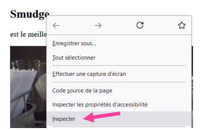
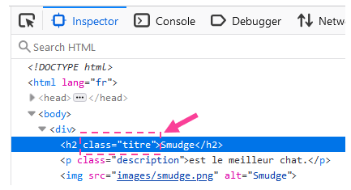
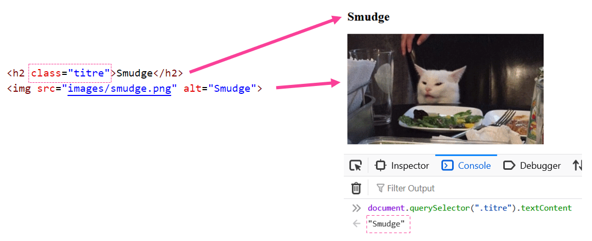
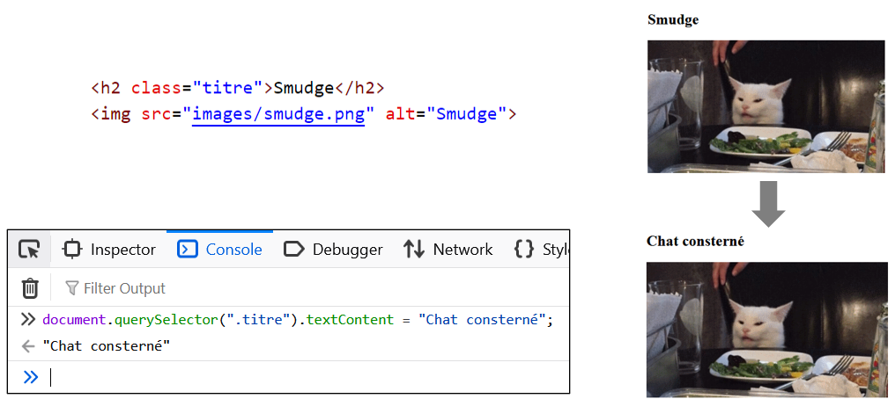
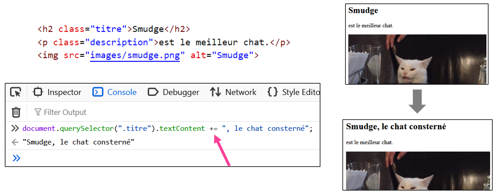
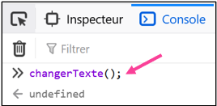
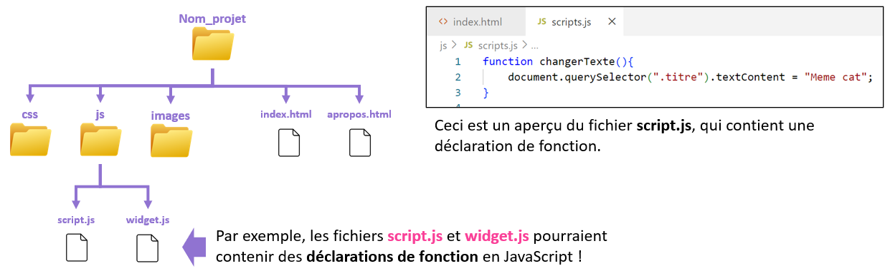
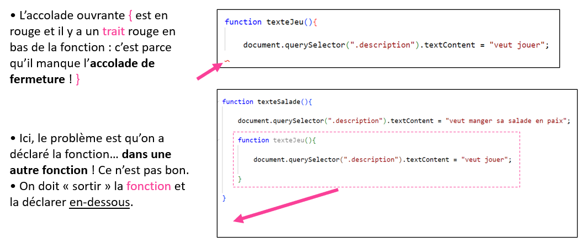
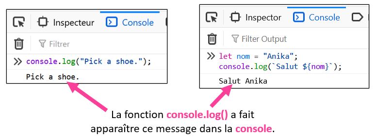
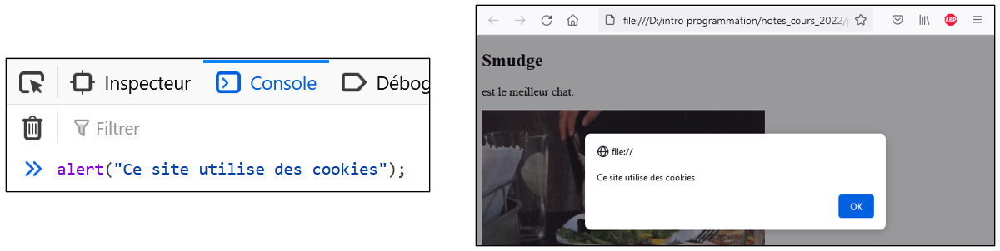

# Rencontre 7 - DOM et fonctions

> **Aujourd'hui :** page Web → DOM → texte → fonctions simples.

À la rencontre 6, notre JavaScript travaillait surtout avec des **valeurs dans la console**. Aujourd'hui, notre code va commencer à **agir directement sur une page Web**.

## 🌐 Ouvrir une page Web pour la manipuler

Nous allons travailler avec des projets Web qui contiennent déjà un fichier HTML et un fichier JavaScript.

Ouvrez le fichier **`index.html`** dans **Google Chrome** ou **Mozilla Firefox**, puis ouvrez les outils de développement avec `F12` ou **clic-droit → Inspecter**.

Nous utiliserons encore la **console** pour tester rapidement du code et appeler nos fonctions.

:::tip

Si vous modifiez la page avec JavaScript dans la console, les changements sont **temporaires**. Une actualisation de la page remet le HTML dans son état initial.

:::

## 📦 Le DOM (Document Object Model)

Le **DOM** est la représentation de la page Web que JavaScript peut consulter et modifier.

Grâce au DOM, JavaScript peut par exemple :

- lire le texte d'un élément;
- remplacer ou ajouter du texte;
- modifier des classes ou des styles;
- changer des images;
- réagir plus tard à des clics et à d'autres événements.

Pour R7, nous nous concentrons sur une seule chose : **trouver un élément dans la page et lire ou modifier son texte**.

## 🎯 Trouver un élément avec `querySelector`

Vous connaissez déjà les **classes CSS**. Nous allons les réutiliser en JavaScript.

Prenons cet élément HTML :

```html
<div class="pikachu">Please pick a shoe.</div>
```

Pour sélectionner cet élément en JavaScript, on peut écrire :

```js
document.querySelector(".pikachu")
```

Remarquez la même syntaxe qu'en CSS : une classe est précédée d'un point `.`.

:::tip Retrouver une classe dans la page

Si vous ne connaissez pas la classe d'un élément, faites **clic-droit → Inspecter** directement sur l'élément.

<center></center>

Le navigateur affiche alors son HTML. Ici, le titre possède la classe `titre` :

<center></center>

:::

### 🧩 Décortiquer la sélection

Prenons :

```js
document.querySelector(".titre")
```

- `document` représente la page Web;
- `querySelector(...)` demande de trouver un élément dans cette page;
- `".titre"` est le **sélecteur CSS** utilisé pour le trouver.

Dans R7, nous utiliserons principalement des **sélecteurs de classe** comme `".titre"`, `".description"` ou `".prix"`.

:::note Classe ou `id`?

`querySelector()` peut utiliser les mêmes sélecteurs que le CSS.

Avec une **classe** :

```js
document.querySelector(".titre")
```

Avec un **id** :

```js
document.querySelector("#titrePrincipal")
```

Un `id` est normalement **unique dans la page**, alors qu'une même classe peut être utilisée sur plusieurs éléments.

Si plusieurs éléments possèdent la même classe, `querySelector(".classe")` retourne seulement **le premier élément correspondant**.

Dans les exercices de R7, nous utiliserons donc des classes choisies de façon à cibler un élément précis. Plus tard, nous verrons comment récupérer **plusieurs éléments à la fois**.

:::

## 🔍 Lire le texte avec `textContent`

Pour obtenir le texte contenu dans un élément, on ajoute `.textContent` :

```js
document.querySelector(".titre").textContent
```

Si l'élément contient :

```html
<h1 class="titre">Smudge</h1>
```

JavaScript nous donnera :

```text
Smudge
```

<center></center>

### 📦 Mettre le texte dans une variable

Comme n'importe quelle autre valeur, le texte lu dans la page peut être conservé dans une variable :

```js
let titre = document.querySelector(".titre").textContent;
```

La variable `titre` contient maintenant le texte de l'élément.

C'est notre premier vrai pont entre **R6** et **R7** : une valeur provenant de la page peut être stockée, réutilisée et combinée avec d'autres valeurs.

## 📝 Modifier le texte d'un élément

### Remplacer avec `=`

Pour remplacer le contenu textuel :

```js
document.querySelector(".titre").textContent = "Chat consterné";
```

<center></center>

Le `=` joue exactement le même rôle qu'avec une variable : on **affecte une nouvelle valeur**.

### Ajouter avec `+=`

Pour ajouter du texte à la fin du texte existant :

```js
document.querySelector(".description").textContent += " Yikes.";
```

<center></center>

Encore une fois, c'est le même `+=` que dans R6.

### Utiliser une variable

On n'est pas obligé d'écrire directement une chaîne de caractères :

```js
let nouveauTitre = "Meme cat";
document.querySelector(".titre").textContent = nouveauTitre;
```

On peut aussi récupérer du texte dans la page, le combiner, puis le réafficher :

```js
let titre = document.querySelector(".titre").textContent;
let description = document.querySelector(".description").textContent;

document.querySelector(".resultat").textContent =
    `${titre} ${description}`;
```

Cette dernière ligne réutilise les **littéraux de gabarits** vus en R6.

:::important Le réflexe DOM de R7

Quand vous voyez une consigne comme « modifier le texte du titre », pensez :

1. **Quelle est la classe de l'élément?**
2. **Je le sélectionne avec `document.querySelector(...)`.**
3. **Je lis ou je modifie son `.textContent`.**

:::

## 🔩 Fonctions

Jusqu'ici, nous avons souvent écrit nos instructions une ligne à la fois dans la console.

Une **fonction** permet de donner un nom à un bloc de code afin de pouvoir l'exécuter à nouveau quand on le souhaite.

### ▶️ Appeler une fonction

Supposons qu'une fonction nommée `changerTexte` existe déjà.

Pour l'exécuter :

```js
changerTexte();
```

Les parenthèses `()` sont importantes : elles indiquent qu'on veut **appeler** la fonction.

<center></center>

### 🧱 Déclarer une fonction

Voici la déclaration de cette fonction :

```js
function changerTexte(){
    document.querySelector(".titre").textContent = "Meme cat";
}
```

Les parties importantes sont :

- `function` : indique qu'on déclare une fonction;
- `changerTexte` : le nom choisi pour la fonction;
- `()` : les parenthèses de la fonction — elles restent vides pour le moment;
- `{ ... }` : les accolades qui délimitent le code exécuté par la fonction.

:::danger Déclarer ≠ appeler

Ces deux actions sont différentes :

```js
// Déclaration : je définis ce que la fonction fera.
function direBonjour(){
    console.log("Bonjour!");
}

// Appel : j'exécute la fonction.
direBonjour();
```

Déclarer une fonction ne l'exécute pas automatiquement.

:::

### 📄 Où écrire nos fonctions?

Dans les exercices, les fonctions seront écrites dans le fichier **`js/script.js`** du projet.

<center></center>

Les projets fournis pour le laboratoire sont déjà configurés pour charger ce fichier JavaScript. Vous pourrez donc modifier `script.js`, enregistrer, actualiser la page et appeler vos fonctions dans la console.

:::warning

Une erreur fréquente est d'oublier ou de mal placer une accolade `{` ou `}`.

<center></center>

Si une fonction semble « briser tout le fichier », commencez par vérifier les accolades.

:::

## 📍 Portée des variables

L'endroit où une variable est déclarée détermine **où elle peut être utilisée**.

### Variable locale

Une variable déclarée **dans une fonction** est une variable **locale**. Elle existe seulement dans cette fonction.

```js
function afficherMessage(){
    let message = "Bonjour!";
    console.log(message);
}
```

Ici, `message` peut être utilisée dans `afficherMessage()`, mais pas à l'extérieur de cette fonction.

### Variable globale

Une variable déclarée **à l'extérieur de toutes les fonctions** est une variable **globale**. Plusieurs fonctions peuvent alors utiliser et modifier la même valeur.

```js
let gScore = 0;

function ajouterPoint(){
    gScore += 1;
}

function afficherScore(){
    console.log(gScore);
}
```

Dans ce cours, nous utiliserons souvent la lettre `g` au début du nom d'une variable globale, par exemple `gScore` ou `gCouleur`. C'est une **convention du cours** pour les reconnaître plus facilement.

:::tip

Si une valeur sert seulement à une fonction, préférez une **variable locale**.

Utilisez une **variable globale** lorsqu'une valeur doit être partagée entre plusieurs fonctions.

:::

## 🧰 Quelques outils déjà disponibles

Nous pouvons utiliser certaines commandes JavaScript sans les déclarer nous-mêmes.

### `console.log()`

`console.log(...)` affiche une valeur dans la console :

```js
console.log("Fonction terminée.");
```

On peut aussi afficher une variable :

```js
let nom = "Mia";
console.log(nom);
```

<center></center>

### `alert()`

`alert(...)` affiche une petite fenêtre dans la page :

```js
alert("Texte changé!");
```

<center></center>

Ces deux outils seront utiles dans le laboratoire pour vérifier qu'une fonction s'exécute et pour produire un effet visible simple.

## 💬 Commentaires

Les commentaires servent à laisser des notes dans le code. JavaScript les ignore.

Commentaire sur une ligne :

```js
// Cette ligne change le titre.
document.querySelector(".titre").textContent = "Meme cat";
```

Commentaire sur plusieurs lignes :

```js
/*
Cette fonction sera complétée
pendant le laboratoire.
*/
```

Dans les fichiers d'exercices, plusieurs consignes seront écrites directement sous forme de commentaires.

## 🥚 Créer et tester une fonction

Voici un exemple complet :

```js showLineNumbers
function texteSalade(){

    document.querySelector(".description").textContent =
        "veut manger sa salade en paix.";

    alert("Texte changé!");

    console.log("Fonction terminée.");
}
```

Après avoir enregistré le fichier :

1. actualisez la page;
2. ouvrez la console;
3. appelez la fonction :

```js
texteSalade();
```

4. vérifiez que les trois effets attendus se produisent.

:::warning

Écrire seulement :

```js
texteSalade
```

n'appelle pas la fonction.

Pour l'exécuter, il faut les parenthèses :

```js
texteSalade();
```

:::

## 🧾 Résumé

| Je veux… | Exemple |
| --- | --- |
| Sélectionner un élément par sa classe | `document.querySelector(".titre")` |
| Lire son texte | `document.querySelector(".titre").textContent` |
| Remplacer son texte | `document.querySelector(".titre").textContent = "Nouveau"` |
| Ajouter du texte | `document.querySelector(".titre").textContent += "!"` |
| Stocker le texte dans une variable | `let texte = document.querySelector(".titre").textContent;` |
| Déclarer une fonction | `function maFonction(){ ... }` |
| Appeler une fonction | `maFonction();` |
| Afficher dans la console | `console.log("Bonjour");` |
| Afficher une alerte | `alert("Bonjour");` |

:::important Le réflexe principal de R7

**Sélectionner → lire ou modifier → placer le code dans une fonction → tester dans la console.**

:::
